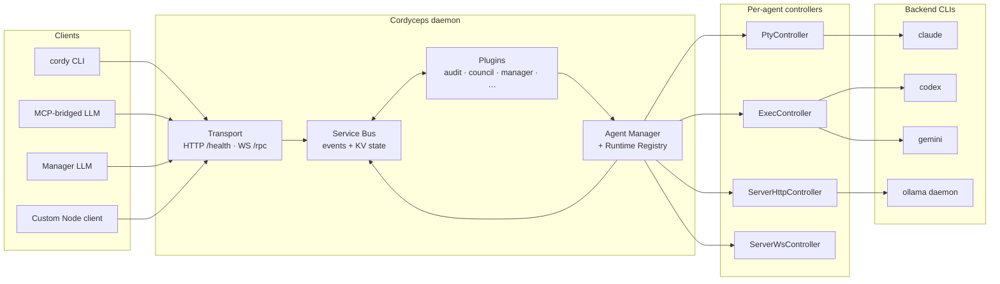
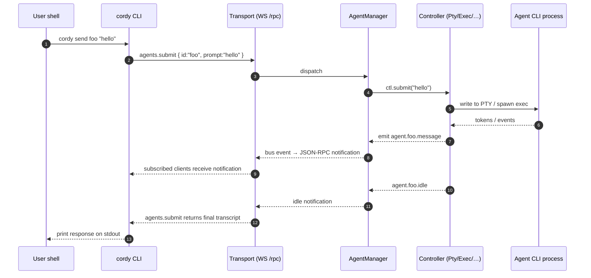
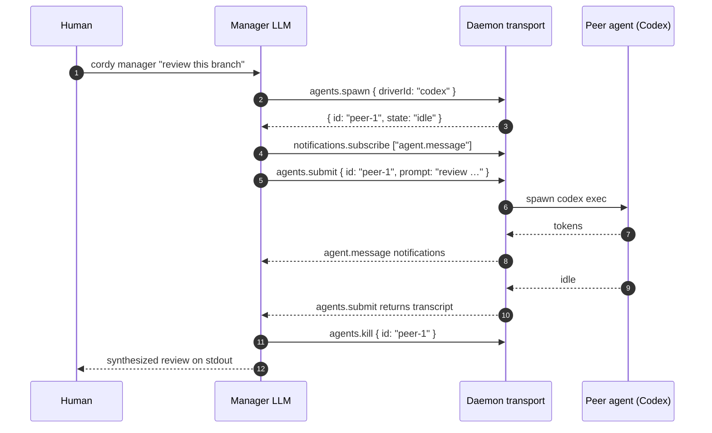
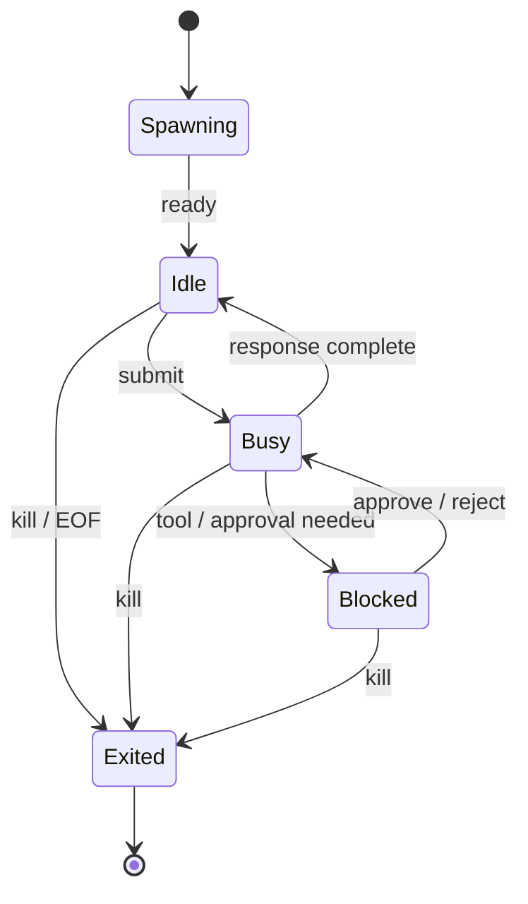

# Architecture

This is a five-minute orientation. For the JSON-RPC method reference see
[`PROTOCOL.md`](PROTOCOL.md); for the driver authoring guide,
[`DRIVERS.md`](DRIVERS.md); for plugins, [`PLUGINS.md`](PLUGINS.md).

## System topology

The daemon is the only process that owns PTY state. Clients are stateless.

## Spawn → send → response

The most interesting flow in the system is what happens between
`cordy send foo "hello"` and the response landing on stdout. Sequence:

`agents.submit` blocks until the agent is idle; subscribed clients see
intermediate `agent.message` and `agent.output` events along the way.

## Manager-agent pattern

The differentiator. A manager LLM is a regular WS client with the same
methods as the human-driven CLI:

Capability parity is the whole point — the manager has every tool an
operator has, no more.

## Agent state machine

`agent.{id}.state` events fire on every transition. Subscribers can build
their own UIs or coordination logic on top.

## Bus key conventions

The bus is a flat keyspace. Static prefixes (used by core):

| Prefix              | Meaning                                                      |
|---------------------|--------------------------------------------------------------|
| `agent.created`     | New agent registered (event)                                 |
| `agent.<id>.state`  | Per-agent state transitions (event)                          |
| `agent.<id>.message`| Per-agent assistant message complete (event)                 |
| `agent.<id>.output` | Per-agent raw output chunk (event, opt-in subscription)      |
| `agent.<id>.blocked`| Per-agent waiting for tool approval (event)                  |
| `agent.<id>.idle`   | Per-agent idle transition (event)                            |
| `agent.<id>.exited` | Per-agent exit (event)                                       |
| `plugin.ready`      | Plugin completed init (event)                                |
| `daemon.stopping`   | Shutdown signal (event)                                      |
| `transport.url`     | Daemon WS URL (KV; non-secret)                               |
| `transport.port`    | Daemon listen port (KV; non-secret)                          |

Plugins coordinate by agreeing on namespaces — the council plugin uses
`council.<id>.…`, audit uses `audit.entry.written`, etc. Nothing imports
across plugins.

## Plugin lifecycle

Loaded in two phases:

1. **Discover** — `discoverBuiltins()` walks an explicit list of in-tree
   plugins. There is no dynamic file-system import; third-party plugins
   are not yet a stable surface.
2. **Sort + load** — `sortPlugins()` groups by `order.priority` (lower
   first), then topologically sorts within each group by `order.after` /
   `order.before`. `loadPlugin()` registers RPC methods, fires `init(ctx)`,
   and tracks unsubscribes / destroyers for clean teardown.

`init` receives a `PluginContext` with `bus`, `agents`, `drivers`, `rpc`,
`config`, `logger`, `cwd`, `subscribe()` (auto-cleaned), `onDestroy()`, and
helpers `emit` / `notify`. On daemon shutdown, `destroyPlugin()` runs in
reverse load order: methods unregister, subscriptions tear down, custom
disposables run.

## Why JSON-RPC over WebSocket

Two requirements drove the choice:

- **Bidirectional in one channel.** The same socket carries client → server
  RPC and server → client notifications. HTTP+SSE would have meant two
  connections to keep in sync; gRPC would have added a code-gen step that
  doesn't pay back at this scale.
- **MCP compatibility.** MCP itself is JSON-RPC over stdio; cordy speaks
  the same wire format on a different transport. The bridge from one to
  the other is mostly framing logic, not protocol translation.

The trade-off: WebSocket frame size limits and head-of-line blocking. Both
are acceptable for a control plane that almost never moves more than a few
KB per call.

## Why driver modes are first-class

A `pty`-only abstraction would have forced exec-only CLIs (Codex, Gemini)
through a fake terminal. Worse: HTTP-streaming services (Ollama) don't fit
PTY semantics at all. Modes (`pty`, `exec`, `server-ws`, `server-http`) let
each driver pick the right transport, and the runtime registry resolves
modes to controllers without touching core. Adding a new family is a
driver plus (sometimes) a runtime plugin; nothing in the bus, transport,
or other drivers has to change.

## Security posture (high-level)

- Transport binds to `127.0.0.1`. Upgrade rejects non-loopback Host /
  Origin as defense in depth.
- 192-bit bearer token, regenerated per daemon start, presented via
  `Authorization: Bearer <token>` (preferred) or `?token=` query string
  (legacy). Compare is constant-time.
- Instance file (`~/.cordyceps/instances/<pid>.json`) is mode `0600`,
  written via tmp + atomic rename so external readers never see partial
  tokens.
- Subprocess spawning everywhere uses array args (`execFileSync`,
  `spawn`); no `shell: true`, no string concatenation.
- Plugin loader uses static imports only — no path traversal surface.

The bearer token is shell-execution-equivalent. Treat it like an SSH key.

## Where to read next

- Add a new CLI family → [`DRIVERS.md`](DRIVERS.md).
- Add a plugin (RPC methods, bus subscriptions) → [`PLUGINS.md`](PLUGINS.md).
- Build a Node client against the daemon → [`PROTOCOL.md`](PROTOCOL.md) and
  [`../examples/basic-agent/`](../examples/basic-agent/).
